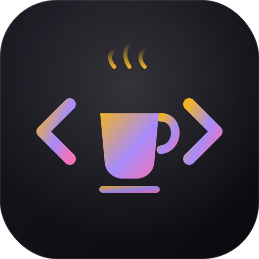

<div align="center">



# Java Mastery Hub

**An offline, installable Core Java learning platform built for Selenium automation interview prep.**

*"Code never lies, comments sometimes do."*

[](https://vitejs.dev)
[](#-install-as-a-desktop-app)
[](https://vikramakula-dev.github.io/Java-Mastery-Hub/)
[](#license)

### 🔗 [**Open the live app**](https://vikramakula-dev.github.io/Java-Mastery-Hub/)

</div>

---

## What is this?

Java Mastery Hub is a single-page study app for Core Java, purpose-built for QA/SDET engineers preparing for Selenium automation interviews. Every concept is taught the same way an experienced engineer would explain it in an interview: not just "what is X" but "here's the bug X causes, and here's how you fix it."

No backend, no account, no tracking — everything runs entirely in your browser and saves to `localStorage`. Install it as a desktop app and it works fully offline.

## Features

| | |
|---|---|
| 📚 **19 structured modules** | From `Introduction` through `JVM` internals, plus dedicated **Advanced Java**, **Design Patterns**, and **Capstone Projects** modules |
| 💡 **159 real-world interview questions** | Scenario-based, not definition recall — *"your parallel suite works with 2 threads but fails with 8, why?"* instead of *"what is a thread?"* |
| 🧩 **53 fill-in-the-blank code challenges** | Active recall practice with instant checking and reveal-solution fallback |
| 🃏 **Flashcards** | Auto-generated from each module's interview questions, with flip and next-card navigation |
| 📝 **Notes** | Freeform per-topic notes with `#tag` highlighting, saved locally |
| 🎯 **Mock interviews** | A dedicated Selenium interview question bank (locators, waits, Shadow DOM, relative locators, and more) |
| 🏗️ **Capstone projects** | Multi-milestone, framework-building projects (Page Object Model, Test Data Manager, parallel cross-browser runner) that stitch every concept together |
| 🧠 **Memory visualizer** | Stack/heap diagrams per topic to build a real mental model of the JVM |
| 🔍 **Live search** | Instant sidebar filtering across all modules |
| 📈 **Progress tracking** | Completion stats, notes count, and study time, persisted locally |
| 📲 **Installable PWA** | Add to your desktop/home screen from the browser — works fully offline afterward |

## Curriculum

<details>
<summary><strong>Core Java (16 modules)</strong></summary>

Introduction · OOPS · Interfaces · Packages · Strings · Wrapper Classes · Java IO · Exception Handling · Multithreading · Nested Classes · Enum & Garbage Collection · Collections Framework · Java Networking · AWT · Swing · JVM

</details>

<details>
<summary><strong>Beyond the basics (3 modules)</strong></summary>

- **Advanced Java** — Generics, Lambdas & Functional Interfaces, the Streams API, `Optional`, method references
- **Design Patterns** — Singleton (with `ThreadLocal`), Factory, Builder, and Page Object Model, each mapped directly to real Selenium framework code
- **Capstone Projects** — build a Mini POM framework, a Test Data Manager, and a parallel cross-browser test runner, milestone by milestone

</details>

Every module includes: **Overview** (concept, why it exists, real-world analogy, common mistakes, core fundamentals) · **Programs** (worked code examples with line-by-line walkthroughs) · **Challenges** (fill-in-the-blank practice) · **Visual Memory** (stack/heap diagrams) · **Interview** (real-world Q&A) · **Flashcards** · **Notes** · **Mock Interview**.

## Suggested learning path

A 4-week plan for a Java developer preparing for Selenium/SDET interviews:

| Week | Focus | Modules |
|---|---|---|
| **1 — Refresh & reframe** | You know Java; learn to narrate it through a QA lens. Read every Interview Q&A even where the code feels easy. | Introduction → OOPS *(slow down here — POM is OOP)* → Interfaces *("WebDriver is an interface" is the #1 opener)* |
| **2 — The big four** | Where Java-for-Selenium interviews are won or lost. Do all Challenges and flashcards. | Collections Framework → Strings → Exception Handling → Wrapper Classes |
| **3 — Stand out** | What separates you from other candidates. | Multithreading *(ThreadLocal = parallel tests)* → Design Patterns *(scripts the "design a framework" answer)* → Advanced Java *(Streams, lambdas, Optional)* |
| **4 — Consolidate** | Build, don't just read. | Capstone Projects *(build Project 1 in a real IDE)* → Mock Interview tracks daily → Flashcards across all modules, 15 min/day |

Skim-only (know the one key fact from each): Packages, Java IO *(properties/CSV reading)*, Nested Classes, Enum & GC *(BrowserType enum)*, Networking *(broken-link checker)*, JVM *(Stack vs Heap)*, AWT *(Robot for uploads — but prefer `sendKeys`)*, Swing.

## Try it now

**[vikramakula-dev.github.io/Java-Mastery-Hub](https://vikramakula-dev.github.io/Java-Mastery-Hub/)** — no install, runs straight in your browser.

## Getting started (local)

```bash
# Clone
git clone https://github.com/vikramakula-dev/Java-Mastery-Hub.git
cd Java-Mastery-Hub

# Install dependencies
npm install

# Start the dev server
npm run dev
```

Open the printed `http://localhost:5173` URL in your browser.

### Build for production

```bash
npm run build
```

This produces a single self-contained `dist/index.html` — everything (JS, CSS, and this whole app) inlined into one file. Double-click it and it runs, no server required.

## Install as a desktop app

Java Mastery Hub is a full PWA:

1. Run `npm run build && npm run preview`
2. Open the printed preview URL (e.g. `http://localhost:4173`) in Chrome or Edge
3. Click the **install** icon in the address bar (or *⋮ menu → Install Java Mastery Hub*)

It launches in its own window with its own icon, and — since the service worker caches everything on first load — keeps working completely offline afterward.

## Tech stack

- **Vanilla JavaScript (ES modules)** — no framework, no runtime dependencies
- **[Vite](https://vitejs.dev)** + [`vite-plugin-singlefile`](https://github.com/richardtallent/vite-plugin-singlefile) for a zero-dependency, single-file production build
- **`localStorage`** for all persistence (notes, progress, completed modules, practice state) — nothing ever leaves your machine
- A hand-rolled **service worker** for offline caching

## Project structure

```
├── index.html              # App shell
├── style.css                # Full visual design system
├── js/
│   ├── main.js               # Event delegation, app bootstrap
│   ├── router.js              # Module/tab rendering
│   ├── components.js          # Notes, flashcards, quiz renderers
│   ├── state.js                # App state + localStorage persistence
│   └── ui.js                    # DOM helpers, syntax highlighter, XSS-safe escaping
├── data/                    # One file per module — the actual curriculum content
├── selenium/
│   └── mock_interviews.js  # Selenium interview question tracks
└── public/
    ├── manifest.webmanifest # PWA manifest
    ├── sw.js                 # Offline service worker
    └── icons/                 # App icon (logo.svg + generated PNGs)
```

Content is fully data-driven — every module is a single object in `data/*.js` with `concept`, `keyPoints`, `examples` (with optional `walkthrough` and `challenges`), and `interview` arrays. Adding new content never requires touching rendering code.

## Security notes

All user-generated content (notes) and all curriculum content rendered into the DOM is passed through a dedicated `escapeHtml()` helper before insertion — there is no unescaped `innerHTML` interpolation of untrusted or dynamic data anywhere in the app.

## License

ISC
